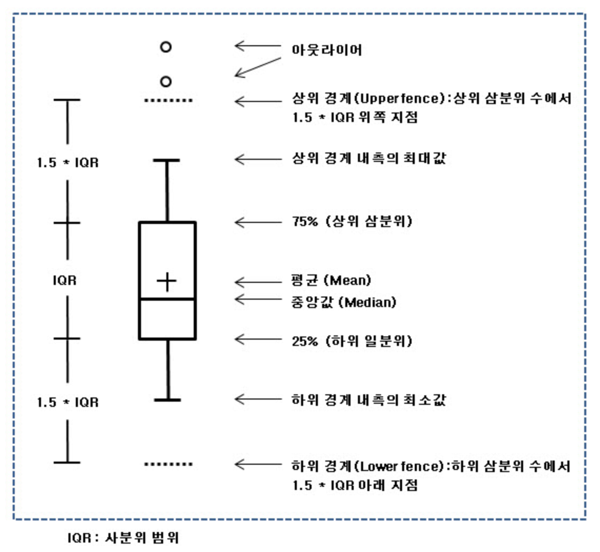

```{r setup, include=FALSE, warning=FALSE}
knitr::opts_chunk$set(echo = TRUE)
library(DT)
library(dplyr)
library(plotly)
library(rmarkdown)
library(ggmap)
library(ggplot2)
library(raster)
library(rgeos)
library(maptools)
library(rgdal)
library(readAny)
library(leaflet)
library(tidyverse)
library(readr)
library(ROCR)
library(PerformanceAnalytics)
library(e1071)
library(caret)
library(gbm)
library(corrplot)
library(ggcorrplot)
library(MASS)
library(rpart)
library(caTools)
library(naivebayes)
library(class)
library(ISLR)
library(glmnet)
library(Hmisc)
library(funModeling)
library(pROC)
library(randomForest)
library(klaR)
library(scales)
library(cluster)
library(factoextra)
library(DataExplorer)
library(ClustOfVar)
library(GGally)
library(dlookr)
library(htmlwidgets)
library(webshot)


```

## 데이터 불러오기

S-Dot 1시간 측정 평균값이 저장된 csv파일 read
```{r }
#분석하고자 하는 csv데이터를 sdot이라는 데이터 프레임에 넣기 
sdot<-read.csv("data/sdot_20200507.csv", fileEncoding = 'euc-kr', head=TRUE, check.names=FALSE) 

```

```{r, layout="l-body-outset"}
#데이터 중 위에서부터 10개의 데이터만 확인
sdot %>% head(10)
```


sdot에 저장된 값에 대한 데이터 요약 
```{r }
#명령어 summary(데이터프레임)
summary(sdot) 
```
위의 값을 확인 했을때 현재 살펴보고자 하는 미세먼지, 초미세먼지 결측값, 음수, 0값을 제거 

```{r }
# 분석 편의상 컬럼 이름 변경 
sdot <- sdot %>% dplyr::rename(super_dust =`초미세먼지 보정 (㎍/㎥)`)
sdot <- sdot %>% dplyr::rename(dust =`미세먼지 보정 (㎍/㎥)`)
sdot <- sdot %>% dplyr::rename(model =시리얼)
sdot <- sdot %>% dplyr::rename(temp =`기온 (℃)`)
sdot <- sdot %>% dplyr::rename(humidity =`상대습도 (%)`)
sdot <- sdot %>% dplyr::rename(lux =`조도 (lux)`)
sdot <- sdot %>% dplyr::rename(db =`소음 (dB)`)
sdot <- sdot %>% dplyr::rename(uvi = `자외선 (UVI)`)


#사용하고자 하는 컬럼 선택 
sdot <- sdot %>% dplyr::select(model, date, hour, dust,super_dust,temp,humidity, lux, db, uvi)

# 결측값 확인 
plot_missing(sdot)
```

```{r }
#미세먼지 값이 0이하 or 초미세먼지 값이 0 이하 값 제거
sdot <-sdot %>% filter(!super_dust <=0 , !dust <=0)

#명령어 summary(데이터프레임)로 미세먼지 보정, 초미세먼지 보정 값 재확인 
summary(sdot) 
#결측값 및 0이하 값 제거 확인
```

describe() : 기술통계  

* n : 결측치를 제외한 데이터 건수  
* na : 결측치 건수  
* mean : 산술평균  
* sd : 표준편차  
* se_mean : 표준오차. sd/sqrt(n)  
* IQR : 사분위 범위(Interquartile range) (Q3-Q1)  
* skewness : 왜도  
* kurtosis : 첨도  
* p25 : Q1. 25% 백분위수  
* p50 : 중위수. 50% 백분위수  
* p75 : Q3. 75% 백분위수  
* p01, p05,p10,p20,p30` : 1%, 5%, 20%, 30% 백분위수  
* p40, p60,p70,p80` : 40%, 60%, 70%, 80% 백분위수  
* p90, p95,p99,p100` : 90%, 95%, 99%, 100% 백분위수  

```{r }
describe(sdot) 

```


diagnose_outlier()은 데이터 프레임의 수치형(연속형과 이산형) 변수의 이상치(outliers)를 진단  
diagnose_outlier()이 반환하는 tbl_df 객체의 변수는 다음과 같음  
* outliers_cnt : 이상치의 개수  
* outliers_ratio : 이상치의 비율(백분율)  
* outliers_mean : 이상치들의 산술평균  
* with_mean : 이상치를 포함한 전체 관측치의 평균  
* without_mean : 이상치를 제거한 관측치의 산술평균  

```{r, warning= FALSE, message=F }

dlookr::diagnose_outlier(sdot) %>% 
   mutate(outliers = outliers_mean / with_mean) %>% 
   arrange(desc(outliers))

```

```{r, warning= FALSE, message=F }
dlookr::plot_outlier(sdot, lux)
```

```{r, warning= FALSE, message=F }
dlookr::plot_outlier(sdot, temp)
```

```{r, warning= FALSE, message=F }
dlookr::plot_outlier(sdot, db)
```

```{r, warning= FALSE, message=F }
dlookr::plot_outlier(sdot, super_dust)
```

```{r, warning= FALSE, message=F }
dlookr::plot_outlier(sdot, dust)
```

```{r, warning= FALSE, message=F }
dlookr::plot_outlier(sdot, humidity)
```

```{r, warning= FALSE, message=F }
dlookr::plot_outlier(sdot, uvi)
```
```{r, warning= FALSE, message=F }
#상관관계 구할 컬럼 가져오기 
cor_heart <- cor(sdot[,4:10])

#상관관계 표현 그래프 1
corrplot(cor_heart, method = "ellipse", type="upper",)
```

```{r, warning= FALSE, message=F }
#상관관계 표현 그래프 2
ggcorrplot(cor_heart,lab = T)

```

```{r, warning= FALSE, message=F }
#상관관계 표현 그래프 3
ggcorr(cor_heart, label = T, label_round = 2)

```

```{r, warning= FALSE, message=F }
#센서 설치정보 불러오기 
model <- read.csv("data/model.csv", head = TRUE, fileEncoding = 'euc-kr')
 
 #model$y<- rnorm(n=851, mean=126.981, sd=0.08446877)
 #model$x<- rnorm(n=851, mean=37.54613, sd=0.05030271)
 #write.csv(model,"data/model.csv", fileEncoding = 'euc-kr')

#SDot 데이터와 설치 정보 결합하기 
sdot_model <- merge(sdot, model, by ="model", all.x = TRUE)

#경도 위도 이름 변경 및 사용데이터 결합
sdot_model <- sdot_model %>% dplyr::rename(long = y, lat = x,gover = gover)

sdot_model <- sdot_model %>% group_by(gover, model, hour) %>% summarise(long = mean(long), lat = mean(lat), super_dust = mean(super_dust), dust = mean(dust), temp = mean(temp), humidity=mean(humidity), lux = mean(lux), db= mean(db), uvi = mean(uvi))

```


## 지도 데이터 불러오기 
지도정보 불러오기 :  
```{r, warning= FALSE, message=F }
#서울시/gover/이름 파일 
p<- read.any("data/sample.csv", header = TRUE) #시각화할 데이터셋

#대한민국 시군구 행정구역 shp파일 
map =readOGR('data/TL_SCCO_SIG.shp',encoding = 'cp949')

#행정구역 shp 전처리
map <- spTransform(map, CRSobj = CRS('+proj=longlat +ellps=WGS84 +datum=WGS84 +no_defs'))
map@polygons[[1]]@Polygons[[1]]@coords %>% head(n = 10L)
new_map <- fortify(map, region = 'SIG_CD')
new_map$id <- as.numeric(new_map$id)

#대한민국 시군구 행정구역 중 서울시만 불러오기 
seoul_map <- new_map[new_map$id <= 11740,]

#서울시 gover 이름 표기 정보 결합
P_merge <- merge(seoul_map, p, by='id')
P_merge <- P_merge %>% dplyr::rename(gover = 시군구명)

top_stat_sdot<-sdot_model %>% group_by(gover, hour) %>% summarise(dust = mean(dust), super_dust = mean(super_dust), temp = mean(temp), humidity=mean(humidity), lux = mean(lux), db= mean(db), uvi = mean(uvi))

top_merge<-merge(P_merge, top_stat_sdot, by="gover", all.x =TRUE)


################### 경계그룹 ##############################
split_data_poly = lapply(unique(P_merge$group), function(x) {
  df = as.matrix(P_merge[P_merge$group == x, c("long", "lat")])
  polys = Polygons(list(Polygon(df)), ID = x)
  return(polys)
})

#split_data_poly
data_polys = SpatialPolygons(split_data_poly)


```


```{r, warning= FALSE, message=F , fig.width = 10, fig.height=7}
# 히스토그램 그리기 
plot_histogram(sdot)
```


박스플롯 이해하기 

<!-- -->

```{r, warning= FALSE, message=F , fig.width = 10, fig.height=7}
#시간별 박스플롯 그리기 
plot_boxplot(sdot_model %>% dplyr::select(lux,dust,hour,dust,super_dust,humidity,temp,db,uvi), by = "hour", theme_config = list(text=element_text(family="NanumGothic")))
```

```{r, warning= FALSE, message=F, fig.width = 10, fig.height=  15}
#자치구별 박스플롯 그리기 
plot_boxplot(sdot_model %>% dplyr::select(lux,dust,super_dust,humidity,temp,db,uvi), by = "gover", theme_config = list(text=element_text(family="NanumGothic")))
```


## 데이터
```{r, warning= FALSE, message=F }
ggplot(top_stat_sdot, aes(x = hour, y = dust, color = gover))+
  geom_smooth(se = FALSE) +
    theme(text=element_text(family="NanumGothic"))
```

```{r, warning= FALSE, message=F }
ggplot(top_stat_sdot, aes(x = hour, y = super_dust, color = gover))+
  geom_smooth(se = FALSE) +
    theme(text=element_text(family="NanumGothic"))
```

```{r, warning= FALSE, message=F }
ggplot(top_stat_sdot, aes(x = hour, y = humidity, color = gover))+
  geom_smooth(se = FALSE) +
    theme(text=element_text(family="NanumGothic"))
```

```{r, warning= FALSE, message=F }
ggplot(top_stat_sdot, aes(x = hour, y = temp, color = gover))+
  geom_smooth(se = FALSE) +
    theme(text=element_text(family="NanumGothic"))
```

```{r, warning= FALSE, message=F }
ggplot(top_stat_sdot, aes(x = hour, y = lux, color = gover))+
  geom_smooth(se = FALSE) +
    theme(text=element_text(family="NanumGothic"))
```


```{r, warning= FALSE, message=F }
ggplot(top_stat_sdot, aes(x = hour, y = db, color = gover))+
  geom_smooth(se = FALSE) +
    theme(text=element_text(family="NanumGothic"))
```


```{r, warning= FALSE, message=F }
test <- sdot_model[6:11]
test2 <- sdot_model[1]
sdot_model2 <- bind_cols(test2,test)


sdot_model3<-sdot_model2[duplicated(sdot_model2$gover),]


#row.names(sdot_model2) <- sdot_model2$gover2

```


```{r, warning= FALSE, message=F }
pgdata2 <- sdot_model %>% group_by(gover) %>%  summarise_all(list(mean = mean ))
pgdata2 <- pgdata2 %>% filter(!gover =='대기측정소')
pgdata2$hour_mean <-NULL
pgdata2$lat_mean <-NULL
pgdata2$long_mean <-NULL
pgdata2$model_mean <-NULL

data2 <- pgdata2

num_df <- data2

result <- num_df[-1]
row.names(result) <- num_df$gover
num_df <- result


apply(num_df, 2, var)


#주성분 분석
data2_pca <- prcomp(num_df, scale = TRUE)
summary(data2_pca)
#첫번째 주성분(PC1)의 누적 기여율은 0.3585, 즉 35%에 해당함.
#PC1이 분석대상의 데이터가 가지고 있던 정보가 PC1 주성분에 집약되어 있는 크기를 설명함

```

```{r, warning= FALSE, message=F }

screeplot(data2_pca, main = "", col = "green", type = "lines", pch = 1, npcs = length(data2_pca$sdev))
#요약과 그래프를 통해서 알 수 있듯이 PC1 + PC2 + PC3의 누적 기여율은 0.88 즉, 약 88%가 되며 성분 선택은 PC1,PC2,PC3까지만 하면 됨


```

```{r, warning= FALSE, message=F }
# 각각에 대한 제1주성분, 제2주성분 점수 구하기
round(predict(data2_pca), 3)


data2_pca$rotation <- -data2_pca$rotation
data2_pca$x <- -data2_pca$x
biplot(data2_pca)

biplot(data2_pca, cex = 0.8, choices = c(1,3)) 


```

SDOT 850개 설치 주소(가상 좌표)
```{r, warning= FALSE, message=F }

#지도에 SDOT 설치 정보 그리기
library(mapview)
m <-leaflet(data_polys) %>%
  # 지도 설정
  setView(lng=126.9784, lat=37.566, zoom=11) %>%
  # 자치구 구역 지정 
  addPolygons(fillColor = "white",weight ="2",color = "black", opacity = 0.8   ) %>%
  # 사용할 맵 스타일 
  addProviderTiles('CartoDB.Positron') %>%
  # 좌표기준 데이터 그리기
  addCircleMarkers(data = sdot_model, lng=~long, lat=~lat, color="#20639B", radius = "2",stroke = TRUE, fillOpacity = 0.8, weight =1)

saveWidget(m, "temp.html", selfcontained = FALSE)
webshot("temp.html", file = "Rplo1.png")

```


S-DoT 850개 별 미세먼지 농도(범례 설정)
```{r, warning= FALSE, message=F }

#미세먼지 농도 지도에 표기하기 - > 범례 설정 

sdot_model$dust_range <- cut(sdot_model$dust,
                             c(0,30,80,150,999), include.lowest = T,
                             labels = c('0','15','35','75'))
colors_sdot <- c("#3982BA", "#66B74F", "#FAE284", "#E93A30")
dust_color_sdot <- colorFactor(palette = colors_sdot , sdot_model$dust_range)


# 초미세먼지 범례설정
sdot_model$super_dust_range <- cut(sdot_model$super_dust,
                             c(0,15,35,75,999), include.lowest = T,
                             labels = c('0','15','35','75'))
colors_sdot <- c("#3982BA", "#66B74F", "#FAE284", "#E93A30")
super_dust_color_sdot <- colorFactor(palette = colors_sdot , sdot_model$super_dust_range)


# 일별
mean_sdot_model <- sdot_model %>% group_by(model) %>% summarise(super_dust =mean(super_dust), dust = mean(dust), long = mean(long), lat = mean(lat))

# 일별 미세먼지 범례설정
mean_sdot_model$dust_range <- cut(mean_sdot_model$dust,
                             c(0,30,80,150,999), include.lowest = T,
                             labels = c('0','15','35','75'))
colors_sdot <- c("#3982BA", "#66B74F", "#FAE284", "#E93A30")
dust_color_sdot <- colorFactor(palette = colors_sdot , mean_sdot_model$dust_range)


# 일별 초미세먼지 범례설정
mean_sdot_model$super_dust_range <- cut(mean_sdot_model$super_dust,
                             c(0,15,35,75,999), include.lowest = T,
                             labels = c('0','15','35','75'))
colors_sdot <- c("#3982BA", "#66B74F", "#FAE284", "#E93A30")
super_dust_color_sdot <- colorFactor(palette = colors_sdot , mean_sdot_model$super_dust_range)


#미세먼지 농도 지도에 표기하기
m<-leaflet(data_polys) %>%
  setView(lng=126.9784, lat=37.566, zoom=11) %>%
  addPolygons(fillColor = "white",weight ="2",color = "black", opacity = 0.8  ) %>%
  addProviderTiles('CartoDB.Positron') %>%
  addCircleMarkers(data = mean_sdot_model, lat = ~lat, lng = ~long,
                   color = ~dust_color_sdot(dust_range), popup = sdot_model$dust,
                   radius = ~sqrt(dust/3),  stroke = FALSE, fillOpacity = 0.1, )

saveWidget(m, "temp.html", selfcontained = FALSE)
webshot("temp.html", file = "Rplo3.png")

```


