## 데이터 불러오기

S-Dot 1시간 측정 평균값이 저장된 csv파일 read

```r
#분석하고자 하는 csv데이터를 sdot이라는 데이터 프레임에 넣기 
sdot<-read.csv("data/sdot_20200507.csv", fileEncoding = 'euc-kr', head=TRUE, check.names=FALSE) 
```


```r
#데이터 중 위에서부터 10개의 데이터만 확인
sdot %>% head(10)
```

```
##         시리얼     date hour 초미세먼지 (㎍/㎥) 미세먼지 (㎍/㎥) 기온 (℃)
## 1  V02Q1940043 2020.5.1    0           7.900000         12.13333  19.39664
## 2  V02Q1940043 2020.5.1    1           9.428571         13.96429  19.23566
## 3  V02Q1940043 2020.5.1    2           9.166667         13.91667  18.87496
## 4  V02Q1940043 2020.5.1    3           8.259259         12.18519  18.99256
## 5  V02Q1940043 2020.5.1    4           8.708333         13.00000  19.07076
## 6  V02Q1940043 2020.5.1    5           8.960000         13.28000  17.53595
## 7  V02Q1940043 2020.5.1    6           8.652174         13.26087  19.16950
## 8  V02Q1940043 2020.5.1    7           8.826087         13.65217  19.39994
## 9  V02Q1940043 2020.5.1    8           9.120000         14.04000  20.27196
## 10 V02Q1940043 2020.5.1    9          10.142857         15.75000  21.27496
##    상대습도 (%) 풍향 (°) 풍속 (m/s) 돌풍 풍향 (°) 돌풍 풍속 (m/s) 조도 (lux)
## 1      70.70000         0          0              0               0      2.000
## 2      71.64286         0          0              0               0      2.000
## 3      72.87500         0          0              0               0      2.000
## 4      72.51852         0          0              0               0      2.000
## 5      72.00000         0          0              0               0      2.000
## 6      67.00000         0          0              0               0     35.240
## 7      73.04348         0          0              0               0    968.000
## 8      73.13043         0          0              0               0   2964.261
## 9      69.80000         0          0              0               0   4823.880
## 10     65.39286         0          0              0               0   7086.500
##    자외선 (UVI) 소음 (dB) 진동(x) (g) 진동(y) (g) 진동(z) (g) 진동(x) 최대 (g)
## 1      2.000000  43.86667  0.01100000  0.04700000    1.028333       0.07466667
## 2      2.000000  43.75000  0.01142857  0.04571429    1.028929       0.07035714
## 3      2.000000  43.87500  0.01166667  0.04625000    1.028333       0.07083333
## 4      2.000000  43.62963  0.01296296  0.04555556    1.027407       0.07185185
## 5      2.000000  43.87500  0.01083333  0.04416667    1.025417       0.07000000
## 6      2.000000  40.72000  0.01000000  0.04160000    0.945600       0.06360000
## 7      2.000000  44.91304  0.01130435  0.04652174    1.028261       0.07521739
## 8      3.217391  44.60870  0.01086956  0.04782609    1.029130       0.07565217
## 9      5.040000  44.68000  0.01160000  0.04600000    1.026800       0.07560000
## 10     8.214286  44.60714  0.01107143  0.04928571    1.026786       0.06535714
##    진동(y) 최대 (g) 진동(z) 최대 (g) 흑구 온도 (℃) 미세먼지 보정 (㎍/㎥)
## 1         0.1183333         1.097667              5              24.26667
## 2         0.1132143         1.095714              5              27.92857
## 3         0.1141667         1.090000              5              27.83333
## 4         0.1103704         1.096667              5              24.37037
## 5         0.1041667         1.093750              5              26.00000
## 6         0.0980000         1.007200              5              26.56000
## 7         0.1069565         1.097826              5              26.52174
## 8         0.1047826         1.094783              5              27.30435
## 9         0.1064000         1.097200              5              28.08000
## 10        0.1075000         1.092857              5              31.50000
##    초미세먼지 보정 (㎍/㎥)
## 1                 15.80000
## 2                 18.85714
## 3                 18.33333
## 4                 16.51852
## 5                 17.41667
## 6                 17.92000
## 7                 17.30435
## 8                 17.65217
## 9                 18.24000
## 10                20.28571
```


sdot에 저장된 값에 대한 데이터 요약 

```r
#명령어 summary(데이터프레임)
summary(sdot) 
```

```
##          시리얼            date            hour       초미세먼지 (㎍/㎥)
##  V02Q1940043:   24   2020.5.1:20280   Min.   : 0.00   Min.   :  0.00    
##  V02Q1940044:   24                    1st Qu.: 5.75   1st Qu.: 14.10    
##  V02Q1940045:   24                    Median :11.50   Median : 23.69    
##  V02Q1940046:   24                    Mean   :11.50   Mean   : 23.56    
##  V02Q1940047:   24                    3rd Qu.:17.25   3rd Qu.: 31.00    
##  V02Q1940049:   24                    Max.   :23.00   Max.   :175.17    
##  (Other)    :20136                                                      
##  미세먼지 (㎍/㎥)   기온 (℃)      상대습도 (%)     풍향 (°)      
##  Min.   :  0.00   Min.   :15.24   Min.   :31.57   Min.   :  0.000  
##  1st Qu.: 18.82   1st Qu.:19.46   1st Qu.:57.06   1st Qu.:  0.000  
##  Median : 31.90   Median :21.21   Median :68.27   Median :  0.000  
##  Mean   : 31.75   Mean   :22.02   Mean   :64.78   Mean   :  2.363  
##  3rd Qu.: 41.67   3rd Qu.:24.41   3rd Qu.:72.12   3rd Qu.:  0.000  
##  Max.   :268.33   Max.   :34.23   Max.   :85.62   Max.   :299.593  
##                                                                    
##    풍속 (m/s)      돌풍 풍향 (°)    돌풍 풍속 (m/s)     조도 (lux)      
##  Min.   :0.00000   Min.   :  0.000   Min.   :0.00000   Min.   :    1.00  
##  1st Qu.:0.00000   1st Qu.:  0.000   1st Qu.:0.00000   1st Qu.:    5.12  
##  Median :0.00000   Median :  0.000   Median :0.00000   Median : 1296.71  
##  Mean   :0.01573   Mean   :  2.328   Mean   :0.03093   Mean   : 6664.73  
##  3rd Qu.:0.00000   3rd Qu.:  0.000   3rd Qu.:0.00000   3rd Qu.: 9079.19  
##  Max.   :4.55714   Max.   :295.750   Max.   :8.40714   Max.   :50200.48  
##                                                                          
##   자외선 (UVI)       소음 (dB)      진동(x) (g)       진동(y) (g)     
##  Min.   :  1.000   Min.   : 0.00   Min.   :0.00000   Min.   :0.00000  
##  1st Qu.:  2.000   1st Qu.:45.38   1st Qu.:0.01833   1st Qu.:0.02815  
##  Median :  2.130   Median :48.07   Median :0.02276   Median :0.04826  
##  Mean   :  9.105   Mean   :48.17   Mean   :0.02797   Mean   :0.05542  
##  3rd Qu.: 10.823   3rd Qu.:50.90   3rd Qu.:0.03500   3rd Qu.:0.07880  
##  Max.   :108.767   Max.   :64.52   Max.   :0.11077   Max.   :0.17696  
##                                                                       
##   진동(z) (g)    진동(x) 최대 (g)  진동(y) 최대 (g) 진동(z) 최대 (g)
##  Min.   :0.000   Min.   :0.00000   Min.   :0.0000   Min.   : 0.000  
##  1st Qu.:1.006   1st Qu.:0.07241   1st Qu.:0.1163   1st Qu.: 1.095  
##  Median :1.029   Median :0.08708   Median :0.1300   Median : 1.107  
##  Mean   :1.026   Mean   :0.09167   Mean   :0.1340   Mean   : 1.117  
##  3rd Qu.:1.050   3rd Qu.:0.10088   3rd Qu.:0.1454   3rd Qu.: 1.124  
##  Max.   :1.116   Max.   :2.41815   Max.   :2.0540   Max.   :10.451  
##                                                                     
##  흑구 온도 (℃)    미세먼지 보정 (㎍/㎥) 초미세먼지 보정 (㎍/㎥)
##  Min.   :  4.833   Min.   :-88.12        Min.   :-98.12         
##  1st Qu.:  5.000   1st Qu.: 36.09        1st Qu.: 23.23         
##  Median :  5.000   Median : 46.00        Median : 27.76         
##  Mean   :  7.590   Mean   : 43.68        Mean   : 26.87         
##  3rd Qu.:  5.000   3rd Qu.: 53.31        3rd Qu.: 32.00         
##  Max.   :195.385   Max.   :345.60        Max.   :179.97         
## 
```
위의 값을 확인 했을때 현재 살펴보고자 하는 미세먼지, 초미세먼지 결측값, 음수, 0값을 제거 


```r
# 분석 편의상 컬럼 이름 변경 
sdot <- sdot %>% dplyr::rename(super_dust =`초미세먼지 보정 (㎍/㎥)`)
sdot <- sdot %>% dplyr::rename(dust =`미세먼지 보정 (㎍/㎥)`)
sdot <- sdot %>% dplyr::rename(model =시리얼)
sdot <- sdot %>% dplyr::rename(temp =`기온 (℃)`)
sdot <- sdot %>% dplyr::rename(humidity =`상대습도 (%)`)
sdot <- sdot %>% dplyr::rename(lux =`조도 (lux)`)
sdot <- sdot %>% dplyr::rename(db =`소음 (dB)`)


#사용하고자 하는 컬럼 선택 
sdot <- sdot %>% dplyr::select(model, date, hour, dust,super_dust,temp,humidity, lux, db)

# 결측값 확인 
plot_missing(sdot)
```

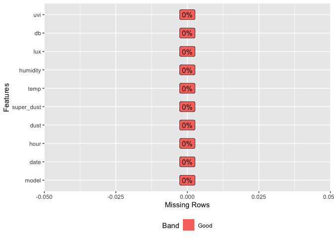<!-- -->


```r
#미세먼지 값이 0이하 or 초미세먼지 값이 0 이하 값 제거
sdot <-sdot %>% filter(!super_dust <=0 , !dust <=0)

#명령어 summary(데이터프레임)로 미세먼지 보정, 초미세먼지 보정 값 재확인 
summary(sdot) 
```

```
##          model             date            hour            dust         
##  V02Q1940043:   24   2020.5.1:19960   Min.   : 0.00   Min.   :  0.1333  
##  V02Q1940044:   24                    1st Qu.: 5.00   1st Qu.: 36.8667  
##  V02Q1940047:   24                    Median :11.00   Median : 46.2069  
##  V02Q1940050:   24                    Mean   :11.49   Mean   : 44.3847  
##  V02Q1940052:   24                    3rd Qu.:18.00   3rd Qu.: 53.4511  
##  V02Q1940054:   24                    Max.   :23.00   Max.   :345.6000  
##  (Other)    :19816                                                      
##    super_dust             temp          humidity          lux       
##  Min.   :  0.03448   Min.   :15.24   Min.   :31.57   Min.   :    1  
##  1st Qu.: 23.48148   1st Qu.:19.46   1st Qu.:57.10   1st Qu.:    5  
##  Median : 27.87750   Median :21.21   Median :68.29   Median : 1286  
##  Mean   : 27.40362   Mean   :22.02   Mean   :64.81   Mean   : 6672  
##  3rd Qu.: 32.07692   3rd Qu.:24.41   3rd Qu.:72.13   3rd Qu.: 9088  
##  Max.   :179.96667   Max.   :34.23   Max.   :85.62   Max.   :50200  
##                                                                     
##        db       
##  Min.   : 0.00  
##  1st Qu.:45.39  
##  Median :48.04  
##  Mean   :48.15  
##  3rd Qu.:50.88  
##  Max.   :64.52  
## 
```

```r
#결측값 및 0이하 값 제거 확인
```

describe() : 기술통계  

* n : 결측치를 제외한 데이터 건수  
* na : 결측치 건수  
* mean : 산술평균  
* sd : 표준편차  
* se_mean : 표준오차. sd/sqrt(n)  
* IQR : 사분위 범위(Interquartile range) (Q3-Q1)  
* skewness : 왜도  
* kurtosis : 첨도  
* p25 : Q1. 25% 백분위수  
* p50 : 중위수. 50% 백분위수  
* p75 : Q3. 75% 백분위수  
* p01, p05,p10,p20,p30` : 1%, 5%, 20%, 30% 백분위수  
* p40, p60,p70,p80` : 40%, 60%, 70%, 80% 백분위수  
* p90, p95,p99,p100` : 90%, 95%, 99%, 100% 백분위수  


```r
describe(sdot) 
```

```
## Warning: The `x` argument of `as_tibble.matrix()` must have column names if `.name_repair` is omitted as of tibble 2.0.0.
## Using compatibility `.name_repair`.
## This warning is displayed once every 8 hours.
## Call `lifecycle::last_warnings()` to see where this warning was generated.
```

```
## Warning: `cols` is now required.
## Please use `cols = c(statistic)`
```

```
## # A tibble: 7 x 26
##   variable     n    na   mean     sd se_mean    IQR skewness kurtosis     p00
##   <chr>    <int> <int>  <dbl>  <dbl>   <dbl>  <dbl>    <dbl>    <dbl>   <dbl>
## 1 hour     19960     0   11.5 6.93e0  0.0490 1.30e1  0.00177   -1.20   0     
## 2 dust     19960     0   44.4 1.48e1  0.105  1.66e1  0.299     11.5    0.133 
## 3 super_d… 19960     0   27.4 7.96e0  0.0564 8.60e0  0.203      9.33   0.0345
## 4 temp     19960     0   22.0 3.06e0  0.0217 4.95e0  0.696     -0.622 15.2   
## 5 humidity 19960     0   64.8 9.60e0  0.0680 1.50e1 -0.694     -0.657 31.6   
## 6 lux      19960     0 6672.  1.04e4 73.4    9.08e3  1.92       3.08   1     
## 7 db       19960     0   48.2 4.49e0  0.0318 5.49e0 -1.44      15.8    0     
## # … with 16 more variables: p01 <dbl>, p05 <dbl>, p10 <dbl>, p20 <dbl>,
## #   p25 <dbl>, p30 <dbl>, p40 <dbl>, p50 <dbl>, p60 <dbl>, p70 <dbl>,
## #   p75 <dbl>, p80 <dbl>, p90 <dbl>, p95 <dbl>, p99 <dbl>, p100 <dbl>
```


diagnose_outlier()은 데이터 프레임의 수치형(연속형과 이산형) 변수의 이상치(outliers)를 진단  
diagnose_outlier()이 반환하는 tbl_df 객체의 변수는 다음과 같음  
* outliers_cnt : 이상치의 개수  
* outliers_ratio : 이상치의 비율(백분율)  
* outliers_mean : 이상치들의 산술평균  
* with_mean : 이상치를 포함한 전체 관측치의 평균  
* without_mean : 이상치를 제거한 관측치의 산술평균  


```r
dlookr::diagnose_outlier(sdot) %>% 
   mutate(outliers = outliers_mean / with_mean) %>% 
   arrange(desc(outliers))
```

```
##    variables outliers_cnt outliers_ratio outliers_mean  with_mean without_mean
## 1        lux         1938     9.70941884   33086.70739 6672.20456   3831.71479
## 2       temp            5     0.02505010      32.74142   22.02408     22.02140
## 3         db          375     1.87875752      40.93486   48.15212     48.29031
## 4 super_dust          875     4.38376754      16.42613   27.40362     27.90691
## 5       dust          583     2.92084168      23.97613   44.38475     44.99879
## 6   humidity            2     0.01002004      33.05000   64.80527     64.80846
## 7       hour            0     0.00000000           NaN   11.49193     11.49193
##    outliers
## 1 4.9588868
## 2 1.4866189
## 3 0.8501155
## 4 0.5994146
## 5 0.5401886
## 6 0.5099894
## 7       NaN
```


```r
dlookr::plot_outlier(sdot, lux)
```

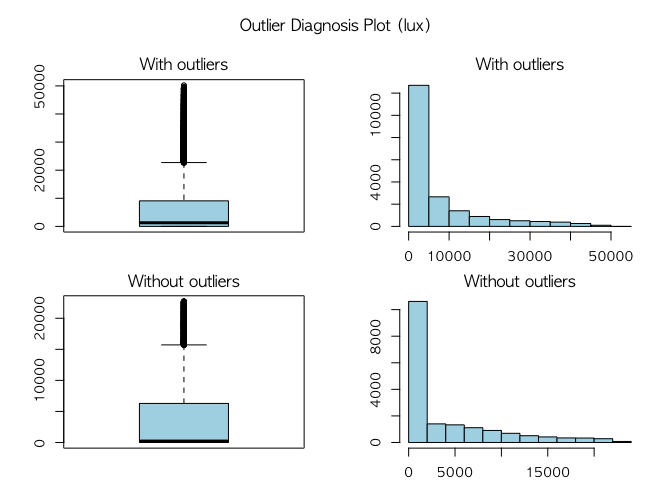<!-- -->


```r
dlookr::plot_outlier(sdot, temp)
```

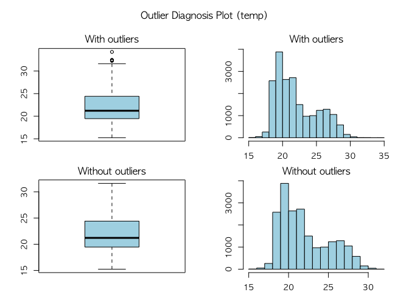<!-- -->


```r
dlookr::plot_outlier(sdot, db)
```

<!-- -->


```r
dlookr::plot_outlier(sdot, super_dust)
```

<!-- -->


```r
dlookr::plot_outlier(sdot, dust)
```

<!-- -->


```r
dlookr::plot_outlier(sdot, humidity)
```

<!-- -->

```r
#시간에 따른 미세먼지 값 확인 
#동적 그래프 생성규칙 

#plot_ly(데이터프레임, x = ~시간, y = ~값)
# plot_ly(sdot, x = ~hour, y = ~dust, name = 'trace 0', type = 'scatter', mode = 'markers',
#         marker = list(opacity = 0.4, color = "blue"))
# 
# plot_ly(sdot, x = ~hour, y = ~super_dust, name = 'trace 0', type = 'scatter', mode = 'markers',
#         marker = list(opacity = 0.4, color = "red"))

cor_heart <- cor(sdot[,3:8])

#상관관계 표현 그래프 1
corrplot(cor_heart, method = "ellipse", type="upper",)
```

<!-- -->


```r
#상관관계 표현 그래프 2
ggcorrplot(cor_heart,lab = T)
```

<!-- -->


```r
#상관관계 표현 그래프 3
ggcorr(cor_heart, label = T, label_round = 2)
```

<!-- -->


```r
#센서 설치정보 불러오기 
model <- read.csv("data/model.csv", head = TRUE, fileEncoding = 'euc-kr')
# 
# model$y<- rnorm(n=851, mean=126.981, sd=0.08446877)
# model$x<- rnorm(n=851, mean=37.54613, sd=0.05030271)
# write.csv(model,"model.csv", fileEncoding = 'euc-kr')

#SDot 데이터와 설치 정보 결합하기 
sdot_model <- merge(sdot, model, by ="model", all.x = TRUE)

#경도 위도 이름 변경 및 사용데이터 결합
sdot_model <- sdot_model %>% dplyr::rename(long = y, lat = x,gover = gover)

sdot_model <- sdot_model %>% group_by(gover, model, hour) %>% summarise(long = mean(long), lat = mean(lat), super_dust = mean(super_dust), dust = mean(dust), temp = mean(temp), humidity=mean(humidity), lux = mean(lux), db= mean(db))
```


## 지도 데이터 불러오기 
지도정보 불러오기 :  

```r
#서울시/gover/이름 파일 
p<- read.any("data/sample.csv", header = TRUE) #시각화할 데이터셋

#대한민국 시군구 행정구역 shp파일 
map =readOGR('data/TL_SCCO_SIG.shp',encoding = 'cp949')
```

```
## OGR data source with driver: ESRI Shapefile 
## Source: "/Users/gim-ilhong/Documents/mac/Github_S-Dot/S_DoT/data/TL_SCCO_SIG.shp", layer: "TL_SCCO_SIG"
## with 250 features
## It has 3 fields
```

```r
#행정구역 shp 전처리
map <- spTransform(map, CRSobj = CRS('+proj=longlat +ellps=WGS84 +datum=WGS84 +no_defs'))
map@polygons[[1]]@Polygons[[1]]@coords %>% head(n = 10L)
```

```
##           [,1]     [,2]
##  [1,] 127.0086 37.58047
##  [2,] 127.0087 37.58045
##  [3,] 127.0088 37.58044
##  [4,] 127.0089 37.58042
##  [5,] 127.0091 37.58039
##  [6,] 127.0092 37.58039
##  [7,] 127.0092 37.58038
##  [8,] 127.0093 37.58038
##  [9,] 127.0093 37.58038
## [10,] 127.0094 37.58036
```

```r
new_map <- fortify(map, region = 'SIG_CD')
new_map$id <- as.numeric(new_map$id)

#대한민국 시군구 행정구역 중 서울시만 불러오기 
seoul_map <- new_map[new_map$id <= 11740,]

#서울시 gover 이름 표기 정보 결합
P_merge <- merge(seoul_map, p, by='id')
P_merge <- P_merge %>% dplyr::rename(gover = 시군구명)

top_stat_sdot<-sdot_model %>% group_by(gover, hour) %>% summarise(dust = mean(dust), super_dust = mean(super_dust), temp = mean(temp), humidity=mean(humidity), lux = mean(lux), db= mean(db))

top_merge<-merge(P_merge, top_stat_sdot, by="gover", all.x =TRUE)


################### 경계그룹 ##############################
split_data_poly = lapply(unique(P_merge$group), function(x) {
  df = as.matrix(P_merge[P_merge$group == x, c("long", "lat")])
  polys = Polygons(list(Polygon(df)), ID = x)
  return(polys)
})

#split_data_poly
data_polys = SpatialPolygons(split_data_poly)
```


```r
plot_histogram(sdot)
```

<!-- -->


```r
plot_boxplot(sdot_model, by = "hour", theme_config = list(text=element_text(family="NanumGothic")))
```

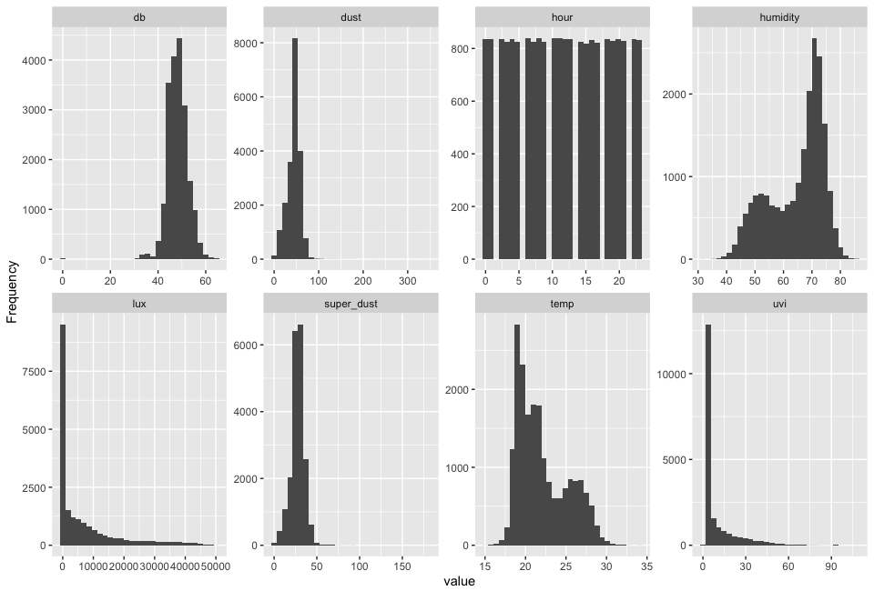<!-- -->


```r
plot_boxplot(sdot_model, by = "gover", theme_config = list(text=element_text(family="NanumGothic")))
```

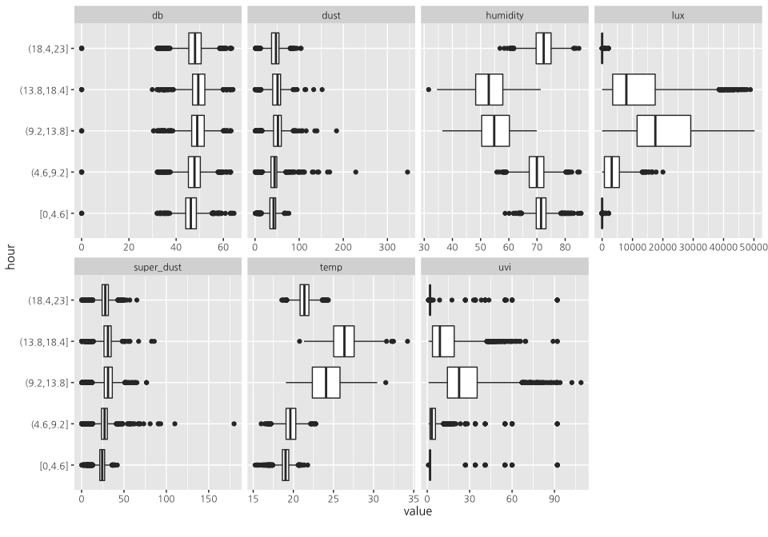<!-- -->


## 데이터

```r
ggplot(top_stat_sdot, aes(x = hour, y = dust, color = gover))+
  geom_smooth(se = FALSE) +
    theme(text=element_text(family="NanumGothic"))
```

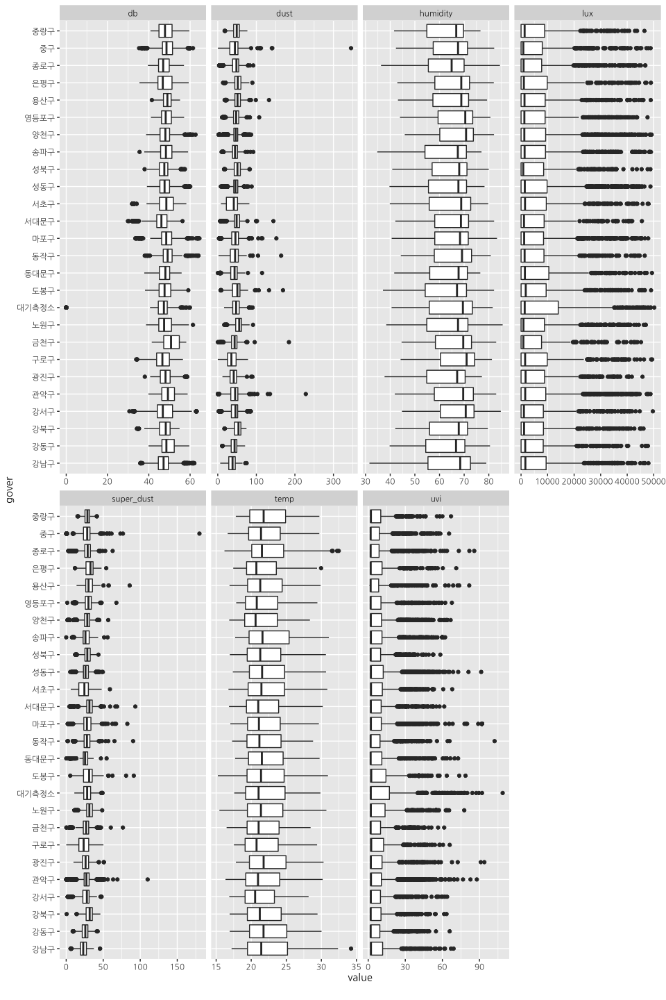<!-- -->


```r
ggplot(top_stat_sdot, aes(x = hour, y = super_dust, color = gover))+
  geom_smooth(se = FALSE) +
    theme(text=element_text(family="NanumGothic"))
```

<!-- -->


```r
ggplot(top_stat_sdot, aes(x = hour, y = humidity, color = gover))+
  geom_smooth(se = FALSE) +
    theme(text=element_text(family="NanumGothic"))
```

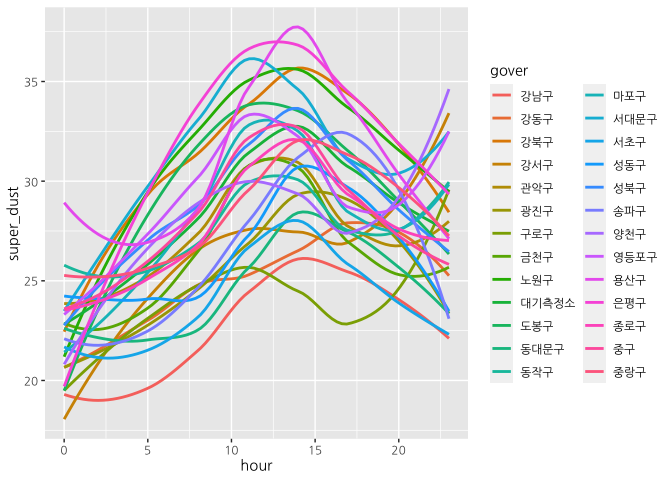<!-- -->


```r
ggplot(top_stat_sdot, aes(x = hour, y = temp, color = gover))+
  geom_smooth(se = FALSE) +
    theme(text=element_text(family="NanumGothic"))
```

<!-- -->


```r
ggplot(top_stat_sdot, aes(x = hour, y = lux, color = gover))+
  geom_smooth(se = FALSE) +
    theme(text=element_text(family="NanumGothic"))
```

<!-- -->


```r
ggplot(top_stat_sdot, aes(x = hour, y = db, color = gover))+
  geom_smooth(se = FALSE) +
    theme(text=element_text(family="NanumGothic"))
```

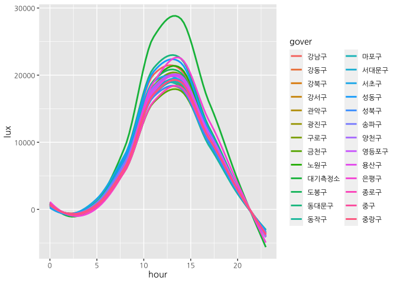<!-- -->


```r
test <- sdot_model[6:11]
test2 <- sdot_model[1]
sdot_model2 <- bind_cols(test2,test)


sdot_model3<-sdot_model2[duplicated(sdot_model2$gover),]


#row.names(sdot_model2) <- sdot_model2$gover2
```


```r
pgdata2 <- sdot_model %>% group_by(gover) %>%  summarise_all(list(mean = mean ))
pgdata2 <- pgdata2 %>% filter(!gover =='대기측정소')
pgdata2$hour_mean <-NULL
pgdata2$lat_mean <-NULL
pgdata2$long_mean <-NULL
pgdata2$model_mean <-NULL

data2 <- pgdata2

num_df <- data2

result <- num_df[-1]
row.names(result) <- num_df$gover
num_df <- result


apply(num_df, 2, var)
```

```
## super_dust_mean       dust_mean       temp_mean   humidity_mean        lux_mean 
##    6.210927e+00    2.053979e+01    1.161621e-01    2.480176e+00    1.866847e+05 
##         db_mean 
##    1.008095e+00
```

```r
#주성분 분석
data2_pca <- prcomp(num_df, scale = TRUE)
summary(data2_pca)
```

```
## Importance of components:
##                           PC1    PC2    PC3    PC4     PC5     PC6
## Standard deviation     1.4666 1.3602 1.1301 0.8103 0.20729 0.14860
## Proportion of Variance 0.3585 0.3084 0.2129 0.1094 0.00716 0.00368
## Cumulative Proportion  0.3585 0.6669 0.8797 0.9892 0.99632 1.00000
```

```r
#첫번째 주성분(PC1)의 누적 기여율은 0.3585, 즉 35%에 해당함.
#PC1이 분석대상의 데이터가 가지고 있던 정보가 PC1 주성분에 집약되어 있는 크기를 설명함
```


```r
screeplot(data2_pca, main = "", col = "green", type = "lines", pch = 1, npcs = length(data2_pca$sdev))
```

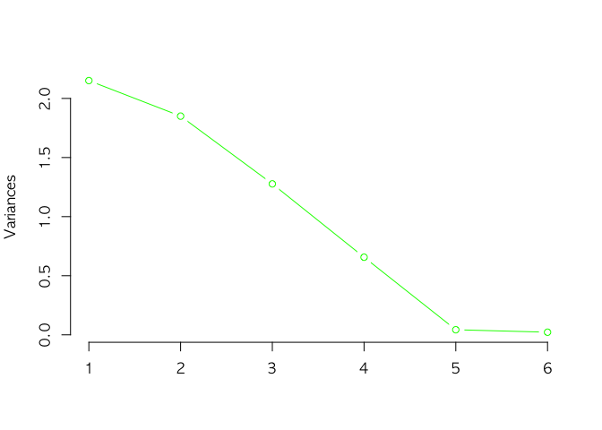<!-- -->

```r
#요약과 그래프를 통해서 알 수 있듯이 PC1 + PC2 + PC3의 누적 기여율은 0.88 즉, 약 88%가 되며 성분 선택은 PC1,PC2,PC3까지만 하면 됨
```


```r
# 각각에 대한 제1주성분, 제2주성분 점수 구하기
round(predict(data2_pca), 3)
```

```
##             PC1    PC2    PC3    PC4    PC5    PC6
## 강남구   -2.620  0.609 -1.607 -0.052  0.036 -0.006
## 강동구   -2.308 -0.425  1.256  0.227  0.045 -0.042
## 강북구    1.556 -1.492  0.023  0.278 -0.056 -0.161
## 강서구    1.249  2.310 -0.270  0.842  0.365 -0.114
## 관악구    0.316  1.300  0.430 -1.144 -0.060 -0.052
## 광진구   -2.039 -0.386  0.328  0.677 -0.232 -0.007
## 구로구   -0.153  2.852 -1.922  0.754 -0.109  0.053
## 금천구   -0.352  2.074  2.784 -0.487  0.084 -0.081
## 노원구    1.418 -1.997 -0.271 -0.791  0.156  0.003
## 도봉구    0.199 -1.335 -0.329 -0.522 -0.264 -0.356
## 동대문구 -1.576 -0.116 -2.212 -0.745  0.046 -0.145
## 동작구   -0.015  0.975  1.228 -0.522 -0.147  0.091
## 마포구    0.300  0.520  0.747  0.123 -0.093 -0.051
## 서대문구  2.236 -0.594 -0.995  1.995 -0.312  0.169
## 서초구   -1.816  0.809 -0.603  0.087  0.062  0.232
## 성동구   -0.974 -1.024 -1.302 -1.007  0.224  0.080
## 성북구    1.078 -0.845  0.510  1.091  0.589 -0.105
## 송파구   -1.647 -1.430  0.354 -0.052  0.031  0.140
## 양천구    1.605  1.649 -0.354 -0.226  0.133 -0.029
## 영등포구  1.499  1.124  0.244 -0.603 -0.152  0.132
## 용산구    1.294 -0.965  0.753 -0.668  0.000  0.389
## 은평구    2.383 -0.832 -1.165 -0.994 -0.107 -0.037
## 종로구   -0.858 -1.229  0.586  1.595 -0.076 -0.058
## 중구     -0.183  0.192  1.048  0.005 -0.323 -0.132
## 중랑구   -0.592 -1.743  0.741  0.138  0.162  0.088
```

```r
data2_pca$rotation <- -data2_pca$rotation
data2_pca$x <- -data2_pca$x
biplot(data2_pca)
```

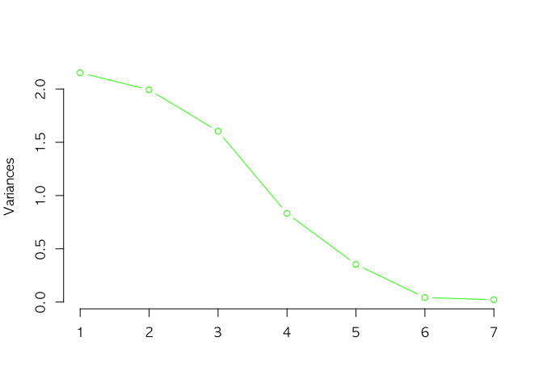<!-- -->

```r
biplot(data2_pca, cex = 0.8, choices = c(1,3)) 
```

<!-- -->


```r
#지도에 SDOT 설치 정보 뿌리기
library(mapview)
m <-leaflet(data_polys) %>%
  setView(lng=126.9784, lat=37.566, zoom=11) %>%
  addPolygons(fillColor = "white",weight ="2",color = "black", opacity = 0.8   ) %>%
  addProviderTiles('CartoDB.Positron') %>%
  addCircleMarkers(data = sdot_model, lng=~long, lat=~lat, color="#20639B", radius = "2",stroke = TRUE, fillOpacity = 0.8, weight =1)

saveWidget(m, "temp.html", selfcontained = FALSE)
webshot("temp.html", file = "Rplo1.png")
```

<!-- -->


```r
# 미세먼지 값 표시하기
# 미세먼지 범례설정

sdot_model$dust_range <- cut(sdot_model$dust,
                             c(0,30,80,150,999), include.lowest = T,
                             labels = c('0','15','35','75'))
colors_sdot <- c("#3982BA", "#66B74F", "#FAE284", "#E93A30")
dust_color_sdot <- colorFactor(palette = colors_sdot , sdot_model$dust_range)


# 초미세먼지 범례설정
sdot_model$super_dust_range <- cut(sdot_model$super_dust,
                             c(0,15,35,75,999), include.lowest = T,
                             labels = c('0','15','35','75'))
colors_sdot <- c("#3982BA", "#66B74F", "#FAE284", "#E93A30")
super_dust_color_sdot <- colorFactor(palette = colors_sdot , sdot_model$super_dust_range)


# 일별
mean_sdot_model <- sdot_model %>% group_by(model) %>% summarise(super_dust =mean(super_dust), dust = mean(dust), long = mean(long), lat = mean(lat))

# 일별 미세먼지 범례설정
mean_sdot_model$dust_range <- cut(mean_sdot_model$dust,
                             c(0,30,80,150,999), include.lowest = T,
                             labels = c('0','15','35','75'))
colors_sdot <- c("#3982BA", "#66B74F", "#FAE284", "#E93A30")
dust_color_sdot <- colorFactor(palette = colors_sdot , mean_sdot_model$dust_range)


# 일별 초미세먼지 범례설정
mean_sdot_model$super_dust_range <- cut(mean_sdot_model$super_dust,
                             c(0,15,35,75,999), include.lowest = T,
                             labels = c('0','15','35','75'))
colors_sdot <- c("#3982BA", "#66B74F", "#FAE284", "#E93A30")
super_dust_color_sdot <- colorFactor(palette = colors_sdot , mean_sdot_model$super_dust_range)


#미세먼지 농도 지도에 표기하기
m<-leaflet(data_polys) %>%
  setView(lng=126.9784, lat=37.566, zoom=11) %>%
  addPolygons(fillColor = "white",weight ="2",color = "black", opacity = 0.8  ) %>%
  addProviderTiles('CartoDB.Positron') %>%
  addCircleMarkers(data = mean_sdot_model, lat = ~lat, lng = ~long,
                   color = ~dust_color_sdot(dust_range), popup = sdot_model$dust,
                   radius = ~sqrt(dust/3),  stroke = FALSE, fillOpacity = 0.1, )

saveWidget(m, "temp.html", selfcontained = FALSE)
webshot("temp.html", file = "Rplo2.png")
```

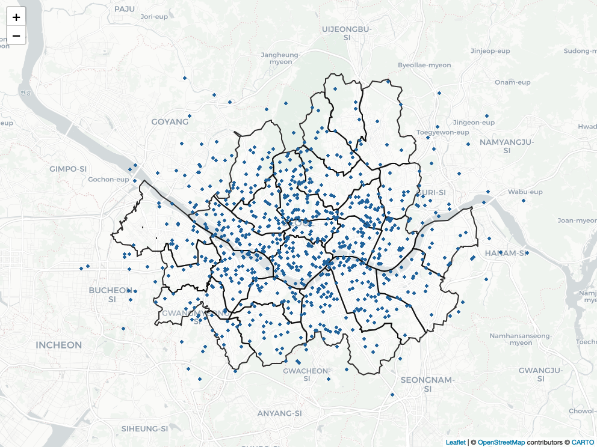<!-- -->
